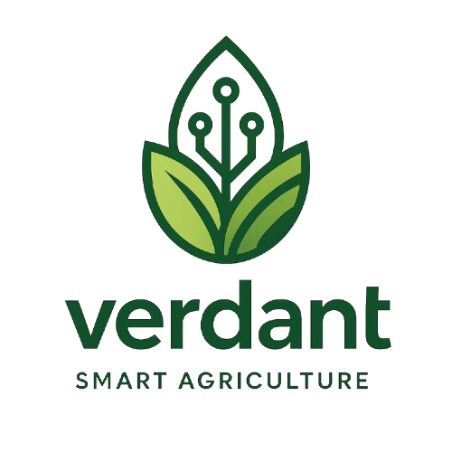

<p align="center">
  
</p>

# 🌿 Verdant - Smart Agriculture System

Verdant is a scalable and intelligent **vertical indoor farming system** that combines **IoT**, **cloud computing**, and **automation** to optimize crop production in urban environments. Built with modularity and scalability in mind, Verdant integrates real-time monitoring, smart decision-making, and remote control across multiple greenhouses and growing cells.

---

## 🚀 Key Features

- **Autonomous Vertical Cell Control**: Each growing cell operates semi-independently using an ESP8266 node with threshold-based control logic.
- **Environmental Sensing**: Real-time temperature, humidity, light, soil moisture, and CO₂ levels are continuously monitored using Arduino sensors.
- **Actuator Automation**: Intelligent control of water pumps, air pumps, heaters, and LED lighting for optimal growth conditions.
- **Dynamic Device Assignment**: MAC address-based ID registration for ESP8266 nodes ensures dynamic and scalable deployment.
- **Multi-Layer Architecture**: Cleanly separated into Physical, Edge, Gateway, and Cloud layers for modular design and maintainability.
- **Real-Time Dashboard**: Responsive Next.js web interface for live monitoring, manual overrides, and visual analytics.
- **Scalable Cloud Backend**: Azure AKS and Event Grid facilitate centralized management and messaging across multiple facilities.
- **Consumption Reporting**: Hourly data on water, air, light, and heater usage for each cell.

---

## ⚙️ System Architecture

```
        +-------------------------+
        |       Azure Cloud       |
        |-------------------------|
        | Nest.js APIs + DB (AKS) |
        | Event Grid Messaging    |
        +-------------------------+
                 ↑      ↓
        +-------------------------+
        | Raspberry Pi Gateway    |
        | Mosquitto Broker        |
        | Python Forwarder        |
        +-------------------------+
                 ↑      ↓
        +-------------------------+
        | ESP8266 Node            |
        | ↔ Arduino Uno           |
        | Sensors + Actuators     |
        +-------------------------+
```

---

## 🖥️ Technologies Overview

### 📡 Communication
- **MQTT Protocol** (Mosquitto Broker)
  - `esp/id/request`, `esp/id/response`
  - `esp/data`, `esp/actuators/consumption`
  - `esp/commands`, `esp/mode/change`

### 🧠 Microcontrollers
- **ESP8266**: Wi-Fi node, actuator logic, ID assignment, local decision-making
- **Arduino Uno**: Sensor interfacing, analog data acquisition, UART to ESP

### 💾 Sensors
- **DHT22**: Temp/Humidity
- **LDR**: Ambient Light
- **Soil Moisture**: Irrigation threshold
- **MH-Z19B CO₂**: Ventilation control

### 🔌 Actuators
- **Air Pump**: Ventilation/CO₂ dilution
- **Water Pump**: Irrigation system
- **LED Light**: Growth-phase lighting
- **Heater**: Temperature regulation

### 🧱 Software Stack
- **Backend**: [Nest.js](https://nestjs.com/), [PostgreSQL](https://www.postgresql.org/)
- **Frontend**: [Next.js](https://nextjs.org/), Charts & Live Data Display
- **Cloud**: [Azure AKS](https://azure.microsoft.com/en-us/services/kubernetes-service/), [Event Grid](https://learn.microsoft.com/en-us/azure/event-grid/)
- **Raspberry Pi**: MQTT Broker + Python bridge to cloud

---


## 📊 Performance Summary

| Component        | Metric                                     |
|------------------|--------------------------------------------|
| ESP8266          | 50ms MQTT response, EEPROM ID storage      |
| Arduino          | Stable sensor reads, 0-1024 LDR resolution |
| Raspberry Pi     | Handles 500+ messages/min                  |
| Cloud API (Nest) | <100ms control command response            |
| Dashboard (Next) | <2.5s load, 3s live update cycle           |
| PostgreSQL       | <50ms query time, indexed for time-series  |

---

## 🧪 Validated Capabilities

- MAC-based ESP ID assignment & EEPROM persistence
- Real-time sensor readings and MQTT publication
- Actuator triggering based on thresholds
- Hourly consumption calculations (time × flow rate/power)
- Remote manual control through UI
- System resilience with offline fallback logic
- Centralized cloud analytics for multiple greenhouses

---

## 👥 Project Team

- **MERZOUKA Younes Abdel Samade**
- **TOUBAL SEGHIR Kheir Eddine**
- **MOULAY LAKHDAR Zakaria**
- **FENDI Mohammed**
- **HARRATH Bouchra**

> 🎓 Higher School of Computer Science Sidi Bel Abbès  
> 🧑‍🏫 Supervised by: **Pr. RAHMOUN Abdellatif**
